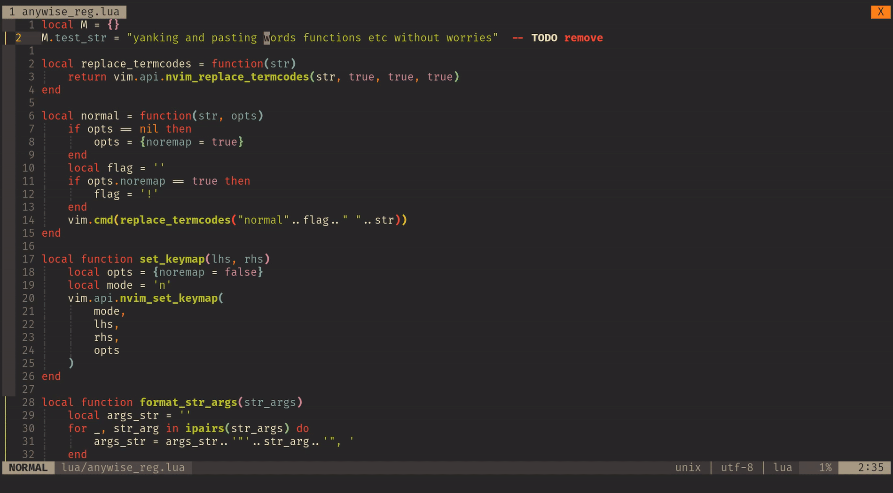

# nvim-anywise-reg.lua

*NOTE: anywise-reg is still in an early version. So if you find any issues or have any ideas, feel free to open an issue.*

## Short intro
Did you ever felt like doing `daf` and then `p` to paste a function somewhere else without having to care if the cursor is in the middle of a function or not, in the same way as doing `dd` followed by `p` to move a line somewhere? Then `anywise-reg` is for you.



## Longer intro
One of the most satisfying things, in my opinion, when using vim is the ease of doing `xp` or `ddp` to move a character to the right or a line down.
The reason this works (using a single key `p` for pasting) is that vim keeps track of what was yanked.
In particular vim keeps track if the yank was `charwise`, `linewise` or `blockwise`, in order to determine how the content of the register should be pasted.

Now, wouldn't it be amazing if this notion could be generalised to more complex patterns, such as words (`daw`), paragraphs (`dap`) or functions and classes (`daf`, `dac` from e.g. [nvim-treesitter-textobjects](https://github.com/nvim-treesitter/nvim-treesitter-textobjects)).
This is exactly what `anywise-reg` does, namely extending the registers to not only have a notion of `charwise`, `linewise` and `blockwise` but any pattern.

`anywise-reg` keeps track of what text-object was used for yanking (deleting, changing etc) the text (and into what register) in order to determine how to paste it.
Before pasting, the cursor is simply moved to the end of the same text-object, currently under the cursor.
In this way there is no hard-coded behaviour, rather the text-objects behaviour is reused and therefore any text-object could be used.
This also means that it is all up to the text-object to do the correct thing.

All the registers `"` and `[0-9][a-z]` are supported and `anywise-reg` updates for example the numbered registers when deleting text.

# Installation

Use your favourite plugin manager, for example using [`packer.nvim`](https://github.com/wbthomason/packer.nvim)
```lua
use {
    'AckslD/nvim-anywise-reg.lua',
}
```
or [`vim-plug`](https://github.com/junegunn/vim-plug):
```vim
Plug 'AckslD/nvim-anywise-reg.lua'
```

# Usage
The plugin needs to be enabled by calling it's setup function.
```lua
require("anywise_reg").setup()
```
By default no keybindings are enabled, see below for configuration.

# Configuration
To use `anywise-reg` you need to specify which operators and textobjects you want keep track of and what key to paste with.
The default config is:
```lua
require("anywise_reg").setup({
    operators = {},
    textobjects = {},
    paste_keys = {},
    register_print_cmd = false,
})
```
* `operators`: The operators to keep track of, e.g. `{y, d}` (see below for details).
* `textobjects`: The textobjects to keep track of, e.g. `{aw, af}` (see below for details).
* `paste_keys`: The keys to use for pasting (see below for details)
* `register_print_cmd`: Whether the command `:RegData` should be setup which can be used to print information of what's being kept track of in the registers, similar to `:reg`. Not that this currently just prints what's stored in the table and is not yet formatted nicely.

`paste_keys` is a table mapping keys to operators. Mostly commonly you would use 
```
require("anywise_reg").setup({
    ...
    paste_keys = {
        ['p' ]= 'p',
        ['P' ]= 'P'
    },
    ...
})
```
This maps the `p` key to the `p` operator and similarly for `P`.
You could also do something like:
```
require("anywise_reg").setup({
    ...
    paste_keys = {
        ['<M-p>' ]= 'p',
        ['<M-P>' ]= 'P'
    },
    ...
})
```
This makes the key `<M-p>` map to the `p` operator, this leaves the `p` operator to paste normally, while `<M-p>` will use the anywise-reg functionality.

`operators` and `textobjects` define which operations (like `y,d,c`) should have the anywise-reg functionality.
For example to be able to only delete (`d`) "outer words" (`aw`), call the setup as follows:
```lua
require("anywise_reg").setup({
    operators = {'d'},
    textobjects = {'aw'},
    paste_keys = {
        ['p' ]= 'p',
    },
})
```
This will setup keybindings for `daw`, `p` `""p` and `"[0-9a-z]p` in normal mode.

`textobjects` can either be a table of strings or a table of table of strings.
In the latter case the cartesian product will be taken between all tables to avoid repetition.
For example a standard config might look like:
```lua
require("anywise_reg").setup({
    operators = {'y', 'd', 'c'},
    textobjects = {
        {'i', 'a'},
        {'w', 'W', 'f', 'c'},
    },
    paste_keys = {
        ['p' ]= 'p',
    },
    register_print_cmd = true,
})
```

## A note on treesitter-textobjects
My initial motion for this plugins was to copy and paste functions.
By default the `if`, `af`, `ic` and `ac` text-objects from [nvim-treesitter-textobjects](https://github.com/nvim-treesitter/nvim-treesitter-textobjects) are `charwise`.
Since `anywise-reg` simply makes use of whatever the text-object does, you may or may not get the desired behaviour by default.
I recently opened a [PR](https://github.com/nvim-treesitter/nvim-treesitter-textobjects/pull/70) to `nvim-treesitter-textobjects` which allows one to specify that some text-objects should actually be `linewise`.

# TODOs and questions
* Currently the numbered registers are not updated as they should if the user does `x` or `s`.
  When we check what operator was applied using `TextYankPost` there is no difference between eg `dd` and `x`.
  However, `dd` does update the numbered registers but `x` doesn't.
  I haven't thought of a way how to handle this properly yet.
* How can registers be handled better? Currently we add a keybind for each register but maybe there is some smarter way.
* Currently the optional command `:RegData` just prints the table stored, would be nicer to format this, for example in the same shape as `:reg`?
